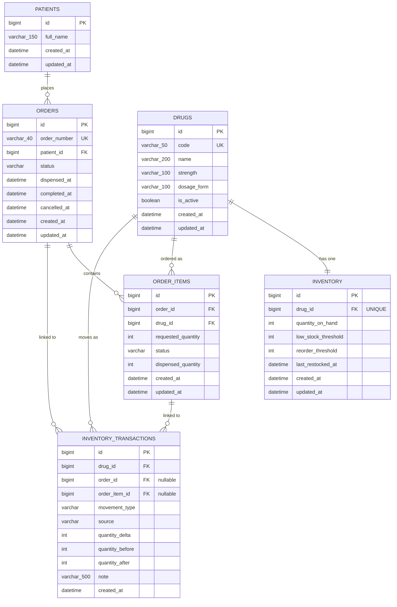

# Database Documentation

MySQL 8+ is the single source of truth for orders and inventory (master
spec §14.1). Schema is managed by Alembic (`backend/alembic/versions/`);
this document describes the schema as currently migrated.

## Entity-Relationship Diagram



## Tables

### `patients`

Intentionally minimal — the assessment only requires a patient name (§26.1).

| Column | Type | Rules |
|---|---|---|
| id | BIGINT | PK, autoincrement |
| full_name | VARCHAR(150) | NOT NULL |
| created_at | DATETIME | NOT NULL |
| updated_at | DATETIME | NOT NULL |

### `drugs`

| Column | Type | Rules |
|---|---|---|
| id | BIGINT | PK, autoincrement |
| code | VARCHAR(50) | UNIQUE, NOT NULL |
| name | VARCHAR(200) | NOT NULL |
| strength | VARCHAR(100) | NULL |
| dosage_form | VARCHAR(100) | NULL |
| is_active | BOOLEAN | NOT NULL, default TRUE |
| created_at | DATETIME | NOT NULL |
| updated_at | DATETIME | NOT NULL |

### `inventory`

One row per drug (1:1). `quantity_on_hand` is only ever mutated by
backend service code inside a row-locked transaction — never directly by
the frontend or by raw SQL.

| Column | Type | Rules |
|---|---|---|
| id | BIGINT | PK, autoincrement |
| drug_id | BIGINT | FK → drugs.id, UNIQUE, NOT NULL |
| quantity_on_hand | INT | NOT NULL, `>= 0`, default 0 |
| low_stock_threshold | INT | NOT NULL, `>= 0`, default 0 |
| reorder_threshold | INT | NOT NULL, `>= 0`, default 0 |
| last_restocked_at | DATETIME | NULL |
| created_at | DATETIME | NOT NULL |
| updated_at | DATETIME | NOT NULL |

**Check constraints** (enforced by MySQL, not just application code):
- `quantity_on_hand >= 0`
- `low_stock_threshold >= 0`
- `reorder_threshold >= 0`
- `reorder_threshold <= low_stock_threshold`

Stock status (`HEALTHY` / `LOW_STOCK` / `CRITICAL` / `OUT_OF_STOCK`) is
**computed, not stored** — see `app/domain/rules.py`. This guarantees the
inventory list API, the inventory detail API, and the dashboard's
low-stock/critical counts can never disagree with each other.

### `orders`

| Column | Type | Rules |
|---|---|---|
| id | BIGINT | PK, autoincrement |
| order_number | VARCHAR(40) | UNIQUE, NOT NULL |
| patient_id | BIGINT | FK → patients.id, NOT NULL |
| status | VARCHAR(30) | NOT NULL — `NEW` \| `WAITING_FOR_STOCK` \| `DISPENSED` \| `COMPLETED` \| `CANCELLED` |
| dispensed_at | DATETIME | NULL |
| completed_at | DATETIME | NULL |
| cancelled_at | DATETIME | NULL |
| created_at | DATETIME | NOT NULL |
| updated_at | DATETIME | NOT NULL |

`status` is stored as `VARCHAR` with application-level enum validation
(SQLAlchemy `Enum(..., native_enum=False)`) rather than MySQL's native
`ENUM` type — deliberately, so adding a new status later is a normal
`VARCHAR` value, not an `ALTER TABLE ... MODIFY ENUM(...)` migration.

### `order_items`

| Column | Type | Rules |
|---|---|---|
| id | BIGINT | PK, autoincrement |
| order_id | BIGINT | FK → orders.id, NOT NULL |
| drug_id | BIGINT | FK → drugs.id, NOT NULL |
| requested_quantity | INT | NOT NULL, `> 0` |
| status | VARCHAR(30) | NOT NULL — `PENDING` \| `WAITING_FOR_STOCK` \| `DISPENSED` \| `CANCELLED` |
| dispensed_quantity | INT | NOT NULL, `>= 0`, default 0 |
| created_at | DATETIME | NOT NULL |
| updated_at | DATETIME | NOT NULL |

**Unique constraint:** `(order_id, drug_id)` — a drug can only appear once
per order (§28).

### `inventory_transactions`

The canonical stock movement ledger (§18) — answers "why is this drug's
stock at this value?" independent of and in addition to application logs.

| Column | Type | Rules |
|---|---|---|
| id | BIGINT | PK, autoincrement |
| drug_id | BIGINT | FK → drugs.id, NOT NULL |
| order_id | BIGINT | FK → orders.id, NULL |
| order_item_id | BIGINT | FK → order_items.id, NULL |
| movement_type | VARCHAR(20) | NOT NULL — `RESTOCK` \| `DISPENSE` \| `ADJUSTMENT` |
| source | VARCHAR(30) | NOT NULL — `NEW_ORDER` \| `PENDING_FULFILMENT` \| `MANUAL_RESTOCK` \| `MANUAL_ADJUSTMENT` |
| quantity_delta | INT | NOT NULL (signed: positive for restock, negative for dispense) |
| quantity_before | INT | NOT NULL |
| quantity_after | INT | NOT NULL |
| note | VARCHAR(500) | NULL |
| created_at | DATETIME | NOT NULL |

No `RestockBatch`/`RestockEvent` table exists — `inventory_transactions`
with `movement_type = RESTOCK` serves that purpose, per the master spec's
own recommendation (§10.1).

## Relationships

```text
Patient  1 ─── N  Order
Order    1 ─── N  OrderItem
Drug     1 ─── 1  Inventory
Drug     1 ─── N  OrderItem
Drug     1 ─── N  InventoryTransaction
Order    1 ─── N  InventoryTransaction
OrderItem 1 ─── N InventoryTransaction   (usually 0 or 1)
```

## Indexes

| Table | Index | Purpose |
|---|---|---|
| drugs | UNIQUE(code) | Lookup/uniqueness by drug code |
| inventory | UNIQUE(drug_id) | Enforce 1:1 with drugs |
| orders | UNIQUE(order_number) | Lookup/uniqueness by order number |
| orders | (status, created_at) | Filtering orders by status, sorted by recency |
| orders | (created_at) | Dashboard "today" queries, default sort |
| orders | (patient_id) | Patient order history |
| order_items | (order_id) | Loading an order's items |
| order_items | UNIQUE(order_id, drug_id) | Duplicate-line prevention |
| order_items | (drug_id, status) | FIFO pending-fulfilment lookup (`WHERE drug_id = ? AND status = WAITING_FOR_STOCK`) |
| inventory_transactions | (drug_id, created_at) | Per-drug ledger history, chronological |
| inventory_transactions | (drug_id) | FK lookup |
| inventory_transactions | (order_id) | FK lookup |
| inventory_transactions | (order_item_id) | FK lookup |

## Migrations

```bash
cd backend
alembic upgrade head        # apply all migrations
alembic revision --autogenerate -m "description"   # generate a new one after model changes
alembic downgrade -1        # roll back the last migration
```

Alembic's `env.py` pulls the database URL from application settings
(`app.core.config`), not from `alembic.ini` — so `.env` remains the single
place connection details are configured.
